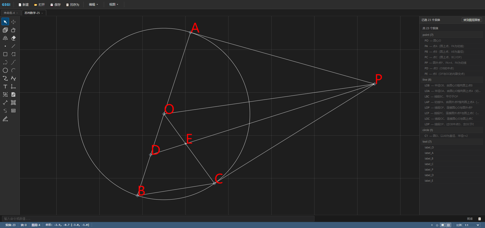
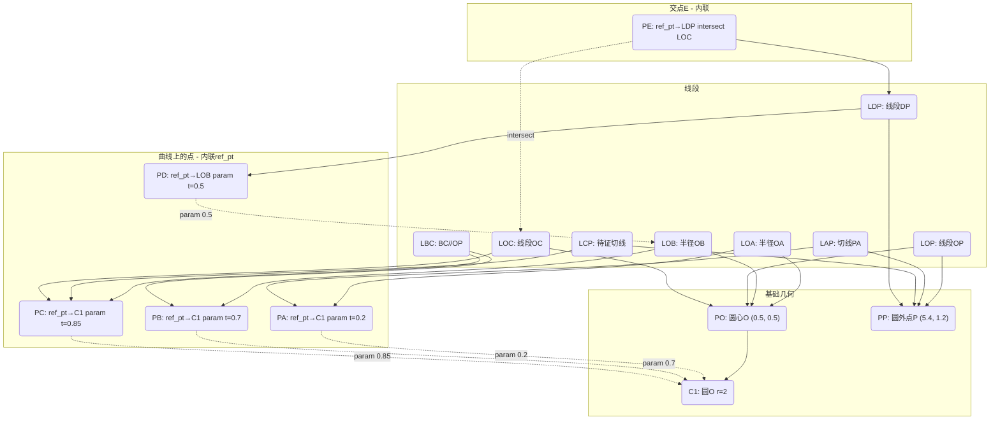

# 苏州数学 - 第25题

如图，$P$ 是以 $AB$ 为直径的 $\odot O$ 外一点，$C$ 为 $\odot O$ 上的一点，$PA$ 是 $\odot O$ 的切线，$BC // OP$，$D$ 为 $OB$ 的中点，连接 $DP$ 交 $OC$ 于 $E$。

(1) 求证：$PC$ 是 $\odot O$ 的切线；

(2) 若 $OA = 2$，$PA = 4$。① 求 $BC$ 的长；② 求 $\tan\angle PEC$ 的值。



GSGI数据见[苏州数学-25-gsgi](苏州数学-25.gsgi)


# GSGI数据依赖关系图



## 依赖链解析

| 实体 | 类型 | 依赖 | 计算方式 |
|------|------|------|----------|
| `PO` | point | 独立 | 绝对坐标 `(0.5, 0.5)` |
| `PP` | point | 独立 | 绝对坐标 `(5.4, 1.2)` |
| `C1` | circle | `center_ref→PO` | 以PO为圆心，r=2 |
| `PA` | point | `ref_pt→{id:C1, represent:{method:param,t:0.2}, ref_op:link}` | 在C1上t=0.2处取点 |
| `PB` | point | `ref_pt→{id:C1, represent:{method:param,t:0.7}, ref_op:link}` | 在C1上t=0.7处取点 |
| `PC` | point | `ref_pt→{id:C1, represent:{method:param,t:0.85}, ref_op:link}` | 在C1上t=0.85处取点 |
| `LOB` | line | `start_ref→PO, end_ref→PB` | 半径OB |
| `PD` | point | `ref_pt→{id:LOB, represent:{method:param,t:0.5}, ref_op:link}` | LOB中点的参数化表达 |
| `LDP` | line | `start_ref→PD, end_ref→PP` | 线段DP |
| `PE` | point | `ref_pt→{id:LDP, represent:{method:intersect,curve_ref:LOC}, ref_op:link}` | DP与OC的内联交点E |
| `LOC` | line | `start_ref→PO, end_ref→PC` | 线段OC（被PE引用求交） |

## 关键依赖关系

- **D（OB中点）**：`PD = resolve({id: LOB, represent: {method: param, t: 0.5}, ref_op: link})`，在LOB上取中点参数
- **E（DP∩OC）**：`PE = resolve({id: LDP, represent: {method: intersect, curve_ref: LOC}, ref_op: link})`，gsgi-tool 通过 `intersectCurves(LineCurve(DP), LineCurve(OC))` 求解交点

```json
// 依赖链伪代码（内联形式）
PE = resolve({id: "LDP", represent: {method: "intersect", curve_ref: "LOC"}, ref_op: "link"})
   → LDP._resolveRepresentByRule(resolver, {method: "intersect", curve_ref: "LOC"})
     → thisCurve = LineCurve(resolve("PD"), resolve("PP"))
     → otherCurve = LineCurve(resolve("PO"), resolve("PC"))
     → intersectCurves(thisCurve, otherCurve)[0].point
```
