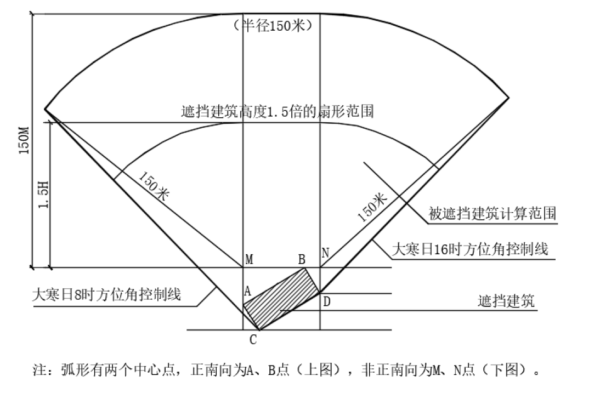

## 日照影响分析

1.有以下情况之一的，应当进行日照影响分析： 

（1）拟建高层建筑对周边现状、在建或规划的住宅建筑和3.2.12条规定的建筑、场地可能产生日照遮挡影响的。 

（2）拟建的住宅建筑和3.2.12条规定的建筑、场地可能受到周边地区现状、在建或规划的高层建筑日照遮挡影响的。 

2.住宅建筑有效日照时间应符合《城市居住区规划设计标准》GB 50180和国家相关标准的规定。 

3.日照影响分析的计算范围： 

（1）被遮挡建筑的计算范围：拟建高层建筑以北，建筑高度1.5倍的扇形阴影范围，150米范围内的现状、在建或规划的建筑（详见附图）。 

附图如下，可查看[gsgi模型](日照影响分析-附图.gsgi)。

（2）遮挡建筑的计算范围：以已经确定的被遮挡建筑为中心，南侧半径150米的扇形范围内的现状、在建或规划的建筑。 

4.日照计算的预设参数应符合以下要求： 

（1）日照基准年应选取公元2001年。 

（2）根据计算方法和计算区域的大小，合理确定采样点间距：窗户，一般可取0.30\~0.60米；建筑，一般可取0.60\~1.00米；场地，一般可取1.00\~5.00米。 

（3）如需要设置时间间隔，不宜大于1.0分钟。 

5.日照计算宜选取当地政府公布的城市经纬度，当建筑实际位置与城市纬度差超过15分（或南北距离超过25千米），或者与城市经度差超过15分（或东西距离超过20千米）时，宜另确定经纬度的取值。 

6.日照计算时间段可以累积计算，累计时间段不宜超过两段，每个有效时间段不宜低于30分钟。 

7.拟建项目地块及其相邻地块建筑的建模要求，以及有日照要求建筑的日照计算基准线及其位置、计算宽度可参考《建筑日照计算参数标准》GB/T 50947的要求，也可根据实际情况研究确定。 

8.日照分析成果的内容，应包含日照分析报告书和相应图件，具体要求由各地根据实际情况研究后确定。  